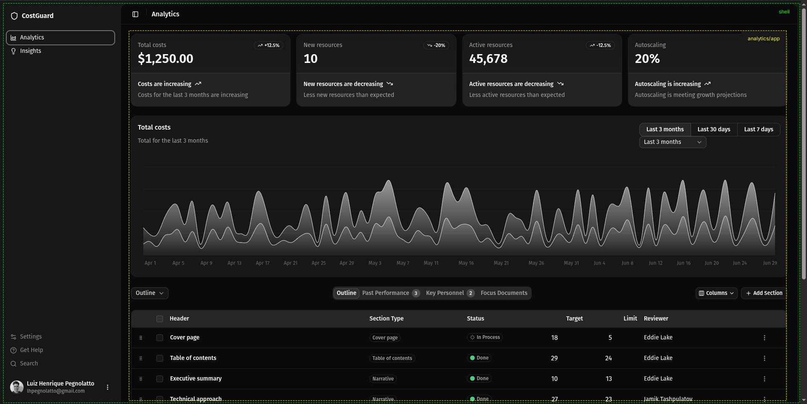
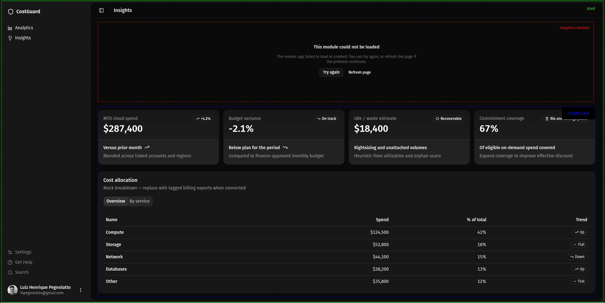

# 🛡️ CostGuard

A small **sandbox** for experimenting with **Module Federation** and **Zephyr Cloud** in a multi-app setup. The UI looks like a FinOps-style dashboard, but that is only sample content—the goal here is tooling and integration patterns, not a real product.

**Live demo:** [click here to see the demo](https://main-costguard-shell-costguard-lhpegnolatto-ze.zephyrcloud.app/)

---

## 🧠 Purpose

This project focuses on exploring:

- Microfrontend architecture using Module Federation
- Cross-app integration and deployment workflows
- Version and environment management with Zephyr Cloud

It is intentionally **not product-driven**—the goal is to understand the trade-offs and behavior of these tools in a realistic setup.

---

## 🏗️ Architecture Overview

This repository is structured as a **pnpm workspaces monorepo** for convenience, but each app is designed to be:

> independently buildable, deployable, and owned

In a real-world scenario, each app would live in its own repository with its own CI/CD pipeline.

### Apps

| App | Role | Dev port |
|-----|------|----------|
| `apps/shell` | Host: routing, layout, lazy-loaded remotes | `3000` |
| `apps/analytics` | Remote: exposes `./app` | `3001` |
| `apps/insights` | Remote: exposes `./app` (and `./crashed` for error scenario demo) | `3002` |

---

## 🧩 Microfrontends (MFEs)

The application is composed of multiple Microfrontends:

- **Shell (Host)**  
  Responsible for:
  - Routing
  - Layout (sidebar, navigation, structure)
  - Dynamically loading remotes

- **Analytics (Remote)**  
  Provides dashboard-style visualizations and data components.

- **Insights (Remote)**  
  Provides complementary views and includes failure scenarios (`./crashed`) to test resilience.

Each remote is loaded at runtime using Module Federation.

I implemented a hybrid loading strategy to balance Initial Performance and System Fault Tolerance:

- **Analytics (Main Route):** Loaded synchronously to prevent LCP (Largest Contentful Paint) issues. Since this is the primary dashboard, it must be available immediately.
- **Insights & Demo (Secondary):** Loaded asynchronously using React.lazy and Suspense to reduce the initial bundle size of the Shell.

And o prevent a "Single Point of Failure", I applied two layers of protection:

- **Error Boundaries:** Every remote is wrapped in a guard. If a microfrontend crashes, the Shell remains interactive, showing a graceful fallback for that specific module.
- **Hybrid Retry Pattern:** For async loads, I implemented both an automatic retry (to handle transient network blips) and an optional manual retry button in the UI, giving the user control to recover the module without refreshing the entire page.





---

## ⚙️ Tech Stack

The stack was chosen to optimize for **developer experience**, **modern patterns**, and **fast iteration**:

- **React 19**  
  Uses the latest React features and concurrent capabilities.

- **Rsbuild**  
  A fast bundler built on Rspack, with first-class Module Federation support.

- **Tailwind CSS**  
  Utility-first CSS framework for rapid UI development.

- **shadcn/ui**  
  Accessible, composable UI components built on top of Radix primitives.

- **pnpm workspaces**  
  Efficient monorepo dependency management.

---

## 🔗 Module Federation

Module Federation enables composing the application from independently deployed parts.

### Key characteristics

- **Runtime composition**  
  The shell loads remotes dynamically via URL.

- **Independent deployment**  
  Each app can be built and deployed separately.

- **Shared dependencies**  
  Critical libraries (e.g., React) must be aligned and configured as singletons.

### Trade-offs

While this improves scalability and team autonomy, it introduces:

- Runtime dependency resolution instead of build-time guarantees
- Need for strict version alignment (especially React)
- Dependency on remote availability at runtime
- Deployment coordination between apps

---

## ☁️ Zephyr Cloud

Zephyr acts as a **build-time integration layer** on top of Module Federation.

Instead of manually managing remote URLs, it:

- Resolves remote dependencies during the build
- Injects environment-specific URLs (snapshots, production, etc.)
- Manages versions across multiple apps

This simplifies integration in distributed systems.

---

## ⚠️ Key Limitation Discovered

A critical behavior observed during this experiment:

- In **development (`pnpm dev`)**, Module Federation runs via a dev server (HMR, in-memory assets)
- Zephyr snapshots rely on **build artifacts on the filesystem**

Because of that:

> When Zephyr replaces localhost remotes with snapshot URLs during development, those snapshots may not contain valid federation artifacts (`remoteEntry` / `mf-manifest`)

### Result

This creates an incompatibility between:

- Local development (dev server)
- Zephyr dependency resolution (`zephyr:dependencies`)

---

## 🧠 Practical Workflow

### Local Development

```bash
pnpm dev
```

- Uses localhost remotes
- Fast iteration with HMR
- No Zephyr dependency resolution

---

### Integration / Deployment

```bash
pnpm build
```

- Generates full build artifacts
- Enables Zephyr dependency resolution
- Ensures consistent remote loading

---

## 💬 Feedback on Zephyr

### ✅ What works well

- **Version management** is excellent  
  Easy to promote, rollback, and manage builds across apps

- **Automatic remote resolution**  
  Reduces manual configuration and environment-specific errors

- **Integration experience**  
  Works smoothly once the build pipeline is properly aligned

---

### ⚠️ Opportunities

- **Dev mode vs snapshot behavior is unclear**  
  The interaction between dev server and snapshot resolution can lead to unexpected failures. This could be better documented or handled explicitly.

- **No control over remote resolution in dev**  
  `zephyr:dependencies` overrides localhost remotes automatically, making it hard to combine local dev with Zephyr previews.

- **Version visibility at scale**  
  The versions page becomes noisy with many snapshots. Filtering (by tag, environment, etc.) or hiding local snapshots would improve usability.

---

## 🚀 Final Thoughts

This project highlights a key insight:

> Module Federation shifts complexity from build-time to runtime,  
> while Zephyr reintroduces structure at build-time through centralized versioning.

Balancing these two layers is essential for a predictable and scalable microfrontend architecture.